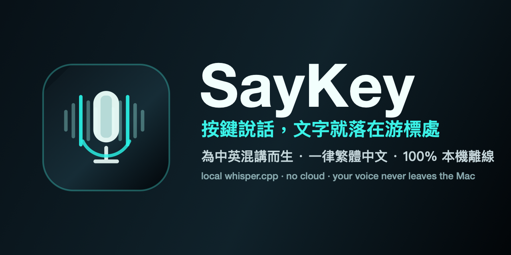

<div align="center">



# SayKey

**按鍵說話，文字就落在游標處。**

一個輕巧的 macOS 選單列語音輸入工具，專為**整天中英混講**的人設計。
按下快捷鍵、說話、再按一次——你的話就以**繁體中文**出現在游標位置，
English 技術詞拼寫正確。

100% 本機 · 離線 · 免 API key · 聲音永遠不離開你的 Mac。

</div>

---

## 為什麼是 SayKey？

市面上多數 Mac 語音輸入工具，假設你只說一種語言、而且要連雲端。SayKey 反過來：

- 🗣️ **為中英混講而生** — 說「幫我看一下 CloudWatch 的 p95 latency，然後 rollback 那個 deployment」，它就照寫，English 術語完整保留。
- 🇹🇼 **一律繁體中文** — Whisper 常吐簡體；SayKey 透過 OpenCC 把每段結果統一轉成台灣繁體（軟體 ≠ 软件、列印 ≠ 打印）。
- 🔒 **完全本機、隱私** — 用 [whisper.cpp](https://github.com/ggml-org/whisper.cpp) 在裝置上辨識。不串 OpenAI API、不靠 Siri、不連外部網路，飛航模式也能用。
- 🧠 **聽得懂你的術語** — 內建 SRE / DevOps 詞庫（kubectl、Terraform、PagerDuty、5xx、p95…），還能自訂專屬的「常錯字」修正表。
- ⚡ **不擋路** — 一個選單列麥克風圖示、閒置時 ~0% CPU、全域快捷鍵、沒有 Dock 圖示、不用註冊帳號。

## 拿來對 AI coding agent 講話（vibe coding）

用 Cursor、Claude Code 這類 AI coding agent 時，最花力氣的往往不是 AI 寫 code，而是**把需求講清楚**。SayKey 補的就是這段：按下快捷鍵，用最自然的**中英混講**把需求、context、要改哪個檔案講出來，它幫你整理成拼字正確的**繁體中文 prompt**（`kubectl`、`p95`、`Terraform` 這些術語不會被聽爛），再貼進 agent 的輸入框。

這裡是**批次**的、剛好夠用：講一段需求 → 看一眼 → 送出，本來就不需要即時串流。而且因為**全程在你的 Mac 上跑、離線、不接任何雲端 API**，就算你在 prompt 裡貼公司內部的服務名、架構、專有 code context，聲音和文字都不會離開這台機器——這正是「要把私有 code 情境餵給 AI」時最在意的地方。

> 講白：**SayKey 不會幫你「用嘴寫 code」，也不產生程式碼。** 寫 code 的是你的 AI agent；SayKey 只負責把你腦袋裡的中英混講需求，變成一段乾淨、可直接貼上的繁中 prompt。

## 運作流程

```
🎙  Control-Option-Space          → 開始錄音（16 kHz 單聲道）
🎙  再按一次 Control-Option-Space   → 停止
🔇  Silero VAD                     → 切掉靜音/雜訊，避免幻聽
🧠  whisper.cpp（large-v3-turbo）  → 本機辨識
🇹🇼  OpenCC  s2twp                  → 統一轉成繁體中文
🔤  術語修正 + 整理                  → CloudWatch / kubectl / Terraform …
📋  進剪貼簿（可選自動 ⌘V）          → 文字落在你的游標處
```

## 需求

- macOS 13+（建議 Apple Silicon）
- [Homebrew](https://brew.sh)
- Xcode Command Line Tools — `xcode-select --install`
- `whisper-cpp` 與 `opencc`（由安裝腳本自動裝好）

## 安裝

### 方式 A（最簡單）：Homebrew

```bash
brew install --cask gary0413/tap/saykey
```

一行搞定：自動裝好 `whisper-cpp` + `opencc`、下載語音與 VAD 模型到 `~/.saykey/models`、
安裝 App 並去除下載隔離（不會被 Gatekeeper 擋）。裝完在「應用程式」打開 SayKey 即可。

### 方式 B：自己 build（開發或想改程式）

```bash
git clone https://github.com/gary0413/SayKey.git
cd SayKey
./scripts/bootstrap.sh
open dist/SayKey.app
```

`bootstrap.sh` 會裝依賴、下載模型、建立本機簽章、編譯出 `dist/SayKey.app`。

完成後選單列會出現麥克風圖示——它**不需要任何特殊權限**就能用（純剪貼簿模式）；
想要自動貼上，請看下方說明。

## 使用方式

1. 把游標放在任何能打字的地方——Slack、瀏覽器表單、VS Code、終端機。
2. 按 **Control-Option-Space** 開始、說話、再按一次停止。
3. 辨識結果進剪貼簿，按 **⌘V** 貼上；或開啟 `autoPaste` 讓它自動幫你貼。

> 啟動後第一次辨識會慢個 1～2 秒（模型 + Metal 暖機），之後就很順。

## 自動貼上與 Accessibility（可選）

模擬送出 **⌘V** 需要 macOS 的 **Accessibility（輔助使用）** 權限。預設關閉
（純剪貼簿是最安全、零權限的路徑）。要開啟，把設定改成 `"autoPaste": true`，
下次錄音時 macOS 會跳出請求 → **打開設定** → 勾選 **SayKey**。
這個權限**每台機器只需授權一次**，而且之後怎麼重新編譯都不會失效
（原理見 [程式碼簽章](#程式碼簽章為什麼授權不會失效)）。

## 設定

**多數人不用改，裝好預設就能用。** 下面是想微調時的完整參考。

設定檔位於 `~/.saykey/config.json`（選單 → **Open Config…** 會建立範本）：

```json
{
  "whisperBinaryPath": "/opt/homebrew/bin/whisper-cli",
  "modelPath": "~/.saykey/models/ggml-large-v3-turbo-q5_0.bin",
  "language": "zh",
  "autoPaste": false,
  "convertToTraditional": true,
  "contextualTerms": ["SRE", "CloudWatch", "kubectl", "你的服務名"],
  "termReplacements": { "terra form": "Terraform", "cube control": "kubectl" }
}
```

| 設定 | 預設 | 作用 |
|---|---|---|
| `whisperBinaryPath` | `/opt/homebrew/bin/whisper-cli` | whisper-cli 執行檔路徑。 |
| `modelPath` | turbo q5_0 | whisper GGML 模型。越大越準、越慢。 |
| `language` | `zh` | 適合中文為主的混講；也可用 `auto` / `en`。 |
| `autoPaste` | `false` | `true` 會自動送 ⌘V（需 Accessibility 權限）。 |
| `convertToTraditional` | `true` | 用 OpenCC `s2twp` 把簡體轉台灣繁體；沒裝 opencc 會自動跳過。 |
| `enableVAD` | `true` | 用 Silero VAD 先切掉靜音/雜訊段，大幅減少「沒講話卻生出字」的幻聽。VAD 模型不存在則自動跳過。 |
| `soundFeedback` | `true` | 辨識完成播一個短音效當「好了」提示（純剪貼簿模式下的主要回饋）。 |
| `useServer` | `true` | 啟動時常駐一個 `whisper-server`，模型只載一次，每句省掉約 300ms 重新載入。啟動中或失敗會自動退回 CLI，不影響辨識。 |
| `hotkey` | `control-option-space` | 全域快捷鍵，例如 `cmd-shift-d`、`ctrl-opt-v`。需至少一個修飾鍵（`control`/`option`/`command`/`shift`）＋一個鍵（`space`/`a`–`z`/`0`–`9`/`return`/`tab`）。**改了要重開 App 才生效**；無法解析會退回預設。 |
| `restoreClipboard` | `true` | 自動貼上模式下，貼完把你原本的剪貼簿內容還原，不讓辨識結果蓋掉你剛複製的東西。純剪貼簿模式（`autoPaste=false`）不受影響、辨識結果照樣留在剪貼簿。 |
| `punctuation` | `half` | 標點策略：`half`（中文全形→半形，技術場景順）、`full`（貼著中文的半形標點→全形，中文散文自然；英文片段如 `Hello, k8s`、`v0.12.0` 不會被誤動）、`keep`（保留 whisper 原樣）。 |
| `autoSpacing` | `true` | 在中文與相鄰的英文字母/數字之間自動補半形空格，例如 `看CloudWatch的p95` → `看 CloudWatch 的 p95`。 |
| `contextualTerms` | SRE 詞庫 | 餵給 whisper prompt 的術語，幫助拼對服務名、縮寫。 |
| `termReplacements` | 常見修正 | 辨識後的固定修正，例如某個老是被聽錯的詞 → 正確拼法。 |

也可用環境變數覆蓋（`SAYKEY_MODEL_PATH`、`SAYKEY_LANGUAGE`、`SAYKEY_AUTO_PASTE`、`SAYKEY_TERMS`…）。

## 調整準確度

- **換大模型**＝單一最有效的提升。`large-v3-turbo`（預設）CP 值最高；`medium` / `large-v3` 更準但更重。
- **自己修常錯字** — 某個詞每次都被聽錯，就在 `termReplacements` 加一條（例如 `"terrafone": "Terraform"`），**下一句立即生效、免重新編譯**。
- **加入你的詞彙** — 把內部服務名、縮寫放進 `contextualTerms`，讓 whisper 拼對。

## 隱私

你的聲音會錄成暫存檔（權限 0600、辨識完刪除，crash 殘留的也會在下次啟動清掉），
辨識**全程在你的 Mac 上完成、不會上傳任何外部伺服器**，飛航模式也能用。

> 技術細節：為了讓模型常駐加速，預設會透過 **127.0.0.1（loopback）本機連線**把音訊交給你電腦上的 `whisper-server`——這條連線只在你的 Mac 內部、不出網。想完全不啟動本機服務可設 `useServer: false`（改用 CLI 逐次辨識）。

剪貼簿會保留最後一段辨識結果（這就是貼上的來源）。

## 程式碼簽章（為什麼授權不會失效）

macOS 把 Accessibility 授權綁在 App 的**程式碼簽章身分**上。Ad-hoc 簽章的身分是
**每次編譯都會變的雜湊（cdhash）**，所以一重新編譯授權就失效。SayKey 改用
**本機專用的穩定自簽憑證**（`scripts/setup_signing.sh`）把身分綁在憑證上，
讓你**授權一次、永久有效**。私鑰只存在你的登入鑰匙圈、絕不進 git；每台機器各自產一張。
細節見 [`scripts/setup_signing.sh`](scripts/setup_signing.sh) 與 [`scripts/build_app.sh`](scripts/build_app.sh) 的註解。

---

## License

[MIT](LICENSE) © 2026 Gary Yu

Built on [whisper.cpp](https://github.com/ggml-org/whisper.cpp) and [OpenCC](https://github.com/BYVoid/OpenCC).

<sub>English speaker? SayKey is a local, privacy-first push-to-talk dictation tool for macOS, optimised for mixed Chinese–English ("code-switching") speech with Traditional Chinese output. Same install steps above.</sub>
